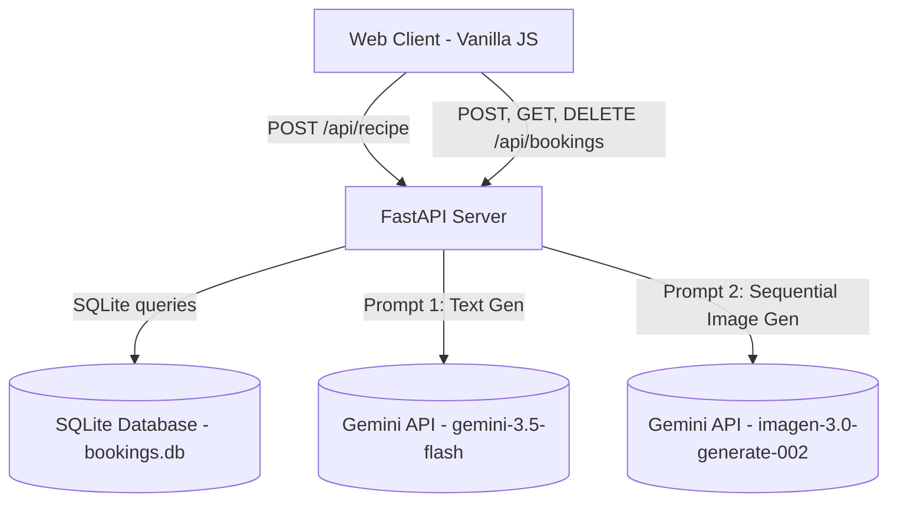

# BnB's Kitchen Recipe & Booking Service — Engineering Design Doc

**Author:** Antigravity Eng
**Status:** Approved v2.0
**Last updated:** May 21, 2026

---

## 1. Summary

We are building a single-page web app that turns leftovers into chef-quality recipes and allows users to schedule in-person preparation sessions with Grandma at BnB's Kitchen. The system uses a Vanilla HTML/CSS/JS frontend, a FastAPI Python backend, and an SQLite database to store reservation details. It orchestrates calls to Google Gemini for recipe text generation (`gemini-3.5-flash`) and dish image generation (`imagen-3.0-generate-002`).

---

## 2. Goals & Non-Goals

**Goals:**
- Provide a robust `/api/recipe` endpoint that accepts ingredients, meal type, and dietary preferences, returning structured recipe details and a Base64 dish image.
- Handle safety and nonsense inputs gracefully via Grandma warnings (non-food/gibberish classification).
- Provide a full set of CRUD endpoints under `/api/bookings` for managing user cooking reservations with Grandma.
- Persist reservations locally in SQLite and filter lists to only display upcoming sessions sorted chronologically.
- Maintain a comprehensive unit testing suite using `pytest` and isolated mock databases.

**Non-Goals:**
- User accounts, login sessions, or JWT authentication (reservations are globally queryable for simplicity in this MVP).
- Real-time websocket notifications (UI uses interval polling to update countdown badges).
- Multi-location scheduling (BnB's Kitchen is a single kitchen location).

---

## 3. System Architecture



### Directory Structure

```
fridge_chef/
├── backend/
│   ├── main.py              # FastAPI app definition, database connections, and routes
│   ├── prompts.py           # System prompts for recipe text and image generation
│   ├── bookings.db          # Production SQLite database (auto-created on start)
│   ├── pyproject.toml       # Python package configuration and dependencies
│   ├── uv.lock              # Lockfile for reproducible Python dependencies
│   └── tests/
│       ├── test_api.py      # Integration tests for FastAPI endpoints (mocked APIs)
│       └── test_bookings.py # Database schema, validation, and filter tests
├── frontend/
│   ├── index.html           # HTML5 structure with tabs and booking modals
│   ├── style.css            # Custom CSS for design tokens, layouts, and ticket sheets
│   └── app.js               # Tab logic, portions scaling, fetch calls, and countdowns
├── BRIEF.md                 # Product brief and core contract
├── product.md               # Product design doc
├── ui.md                    # UX/UI design doc
└── engineering.md           # Engineering design doc
```

---

## 4. SQLite Database Schema

The database consists of a single table, `bookings`, defined as follows:

```sql
CREATE TABLE IF NOT EXISTS bookings (
    id INTEGER PRIMARY KEY AUTOINCREMENT,
    name TEXT NOT NULL,
    email TEXT NOT NULL,
    phone TEXT,
    leftovers TEXT NOT NULL,
    recipe_title TEXT,
    guests INTEGER NOT NULL DEFAULT 2,
    date TEXT NOT NULL,
    time TEXT NOT NULL,
    notes TEXT,
    created_at TIMESTAMP DEFAULT CURRENT_TIMESTAMP
);
```

- **Date Storage:** Stored as `TEXT` in ISO format (`YYYY-MM-DD`).
- **Time Storage:** Stored as `TEXT` in 24-hour format (`HH:MM`).
- **Default Portions/Guests:** Default value of `2`, constrained to `ge=1` by backend validators.

---

## 5. Data Contracts & API Specifications

### 5.1 Recipe Generation Endpoint
`POST /api/recipe`

- **Request Payload:**
```typescript
interface RecipeRequest {
  ingredients: string;               // Text from input field
  dietary_preferences?: string[];    // Array of active chips (e.g. ["Vegan", "Gluten-Free"])
  meal_type?: string;                // Active meal segment button (e.g. "Dinner")
  cooking_style?: string;            // Active cooking style segment (e.g. "Comfort Food")
  equipment?: string[];              // Array of active equipment chips (e.g. ["Stove"])
  time_limit?: string;               // Active time limit segment (e.g. "Under 30 mins")
}
```

- **Response Payload:**
```typescript
interface RecipeResponse {
  input_status: "pure_food" | "mixed" | "non_food" | "gibberish";
  warning_message: string | null;     // Friendly Grandma warning message
  title?: string;                    // Normalized dish name (from recipe_title)
  flavor_tags?: string[];
  grandma_intro?: string;
  prep_time_minutes?: number;
  cook_time_minutes?: number;
  difficulty_level?: string;
  servings_default?: number;
  ingredients?: Array<{
    name: string;
    quantity_per_serving: number;
    unit: string;
  }>;
  ingredientsList?: string[];        // Reconstructed measurements list
  pantry_staples?: string[];
  grandma_secret_tip?: string;
  instructions?: string[];           // Normalized step lists (from steps)
  imageUrl: string;                  // Base64-encoded image string, Unsplash fallback, or empty string
}
```

### 5.2 Booking CRUD Endpoints

#### Create Booking
`POST /api/bookings`
- **Request Payload (`BookingCreate` model):**
  - `name`: string (min_length=1, validator rejects empty/whitespace)
  - `email`: string (validates against regex `^[a-zA-Z0-9._%+-]+@[a-zA-Z0-9.-]+\.[a-zA-Z]{2,}$`)
  - `phone`: string | null (optional)
  - `leftovers`: string (min_length=1, validator rejects empty/whitespace)
  - `recipe_title`: string | null (optional)
  - `guests`: integer (default=2, must be `>= 1`)
  - `date`: string (must be in format `YYYY-MM-DD`)
  - `time`: string (must be in format `HH:MM`)
  - `notes`: string | null (optional)
- **Response Code:** `201 Created`
- **Response Body:** Dict representing the stored database row (including generated `id` and `created_at`).

#### Read Upcoming Bookings
`GET /api/bookings`
- **Response Code:** `200 OK`
- **Response Body:** Array of booking objects.
- **Filtering Logic:** The backend filters out past reservations in memory by comparing the combined `date` and `time` against the current server time (`YYYY-MM-DD HH:MM`). It returns only upcoming and current sessions, ordered chronologically (`ORDER BY date ASC, time ASC`).

#### Delete Booking
`DELETE /api/bookings/{id}`
- **Response Code:** `200 OK` on success, `404 Not Found` if the booking does not exist.
- **Response Body (Success):** `{"message": "Booking cancelled successfully"}`

### 5.3 Local Storage Schema (Saved Recipes)
Saved recipes are serialized and persisted client-side in the browser's `localStorage` under the key `saved_recipes`.
- **Value Format:** A JSON array of `SavedRecipe` objects:
```typescript
interface SavedRecipe {
  id: string;                        // Unique client-side generated UUID or timestamp-based ID
  recipe_title: string;              // Recipe title
  imageUrl: string;                  // Image URL (Base64 data URI or Unsplash fallback)
  prep_time_minutes: number;
  cook_time_minutes: number;
  difficulty_level: string;
  ingredients: Array<{
    name: string;
    quantity_per_serving: number;
    unit: string;
  }>;
  ingredientsList?: string[];
  instructions: string[];
  grandma_intro: string;
  grandma_secret_tip?: string;
  pantry_staples?: string[];
  saved_at: string;                  // ISO 8601 timestamp when saved
}
```

### 5.4 Client-Side Timer Subsystem
Interactive timers operate entirely on the client side inside the DOM state:
- **Duration Parsing:** Steps are scanned upon recipe rendering using a regex pattern (e.g. `/(\d+)\s*(min|minute)/i`) to detect time constraints. If none is found, the timer defaults to `5` minutes.
- **State Machine:**
  - *Duration:* Managed in seconds.
  - *Control States:* Running (`setInterval` active), Paused (interval cleared, remaining time preserved), Canceled (widget hidden, time reset), Expired (timer reaches 0).
- **Chime Synthesis:** Triggered on expiration using the browser's **Web Audio API** to synthesize a cozy sound. This avoids external audio assets.
  - *Synthesizer Node Graph:* `OscillatorNode` (sine/triangle wave at 880Hz/1320Hz) -> `GainNode` (exponential decay over 1.2s) -> `AudioContext.destination`.

---

## 6. Testing Strategy

The test suite is written using `pytest` and runs inside FastAPI's `TestClient` context.

### 6.1 Integration & API Tests (`tests/test_api.py`)
- **`test_health`**: Validates the health endpoint.
- **`test_generate_recipe_success`**: Mocks the Gemini client and verifies that `/api/recipe` successfully normalizes keys and generates a base64 image URL.
- **`test_generate_recipe_missing_fields`**: Simulates incomplete Gemini response content, expecting a `502 Bad Gateway` error.
- **`test_generate_recipe_empty_input`**: Simulates validation failures for short ingredients (less than 2 characters), verifying it triggers a `400 Bad Request`.
- **`test_bookings_flow`**: Runs an end-to-end booking flow: creating a booking, fetching it from the list, and deleting it.

### 6.2 Database & Constraint Tests (`tests/test_bookings.py`)
- **Isolation Fixture:**
  ```python
  @pytest.fixture(autouse=True)
  def setup_test_env():
      os.environ["DB_PATH"] = TEST_DB_PATH
      # Initialize schema on clean test database
      init_db()
      yield
      # Remove temp file after test run
      if os.path.exists(TEST_DB_PATH):
          os.remove(TEST_DB_PATH)
  ```
- **`test_db_initialization`**: Assures database connection and table initialization create the `bookings` table structure correctly.
- **`test_create_booking_success`**: Assures that valid payloads are successfully saved and return populated primary key columns.
- **`test_create_booking_validation_errors`**: Validates field validators (invalid emails, bad date/time formats, zero guests).
- **`test_get_bookings_upcoming_only`**: Inserts one past and two future reservations, and confirms the `GET /api/bookings` endpoint returns only the two future reservations, ordered chronologically.
- **`test_delete_booking_success` & `test_delete_booking_not_found`**: Tests deletion and missing record handling (404 status).

---

## 7. Execution Commands

To execute tests and run the server locally:

```bash
# Run pytest test suite
cd backend
uv run pytest

# Start development server
uv run uvicorn main:app --reload
```
